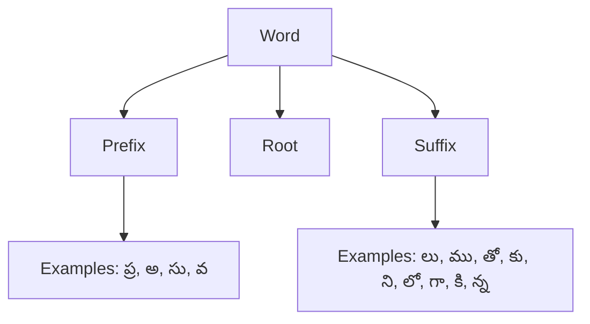

# pytelugu

## Telugu NLP Library

The Natural Language Processing library for Telugu, to provide comprehensive toolkit.

### Features

- Word Tokenization: Splits Telugu text into words and punctuation marks.

### Installation
1. Clone the repository:
   ```bash
   git clone https://github.com/j143/pytelugu
   cd pytelugu
   ```
2. Install dependencies:
   ```bash
   pip install -r requirements.txt
   ```

### Usage

#### Word Tokenization

The `word_tokenize` function splits the sentence into the words.

```python
from src.tokenizer import word_tokenize

text = "నేను బిట్స్ కాలేజీలో చదువుతున్నాను."
tokens = word_tokenize(text)
print(tokens)
# Output: ['నేను', 'బిట్స్', 'కాలేజీలో', 'చదువుతున్నాను', '.']
```

#### Normalization

Remove extra spaces between words in Telugu text.

```python
from src.tokenizer import normalize_text

text = "  నేను   బిట్స్  కాలేజీలో   చదువుతున్నాను.  "
output = normalize_text(text)
print(output)
# Output: "నేను బిట్స్ కాలేజీలో చదువుతున్నాను."
```

#### Identify Part-of-Speech (POS)

Use  `pos_tag` to tag a Part of Speech

```python
from src.tokenizer import pos_tag

text = "నేను పుస్తకం చదువుతున్నాను."
tags = pos_tag(text)
print(tags)
# Output: [('నేను', 'X'), ('పుస్తకం', 'NOUN'), ('చదువుతున్నాను', 'VERB'), ('.', 'PUNCT')]
```

#### Morphological Analysis

The `morphological_analysis` function analyzes a Telugu word and extracts its root, prefix, and suffix.

```python
from src.tokenizer import morphological_analysis

word = "ప్రపంచము"
analysis = morphological_analysis(word)
print(analysis)
# Output: {'root': 'పంచ', 'prefix': 'ప్ర', 'suffix': 'ము'}

word = "పుస్తకాలు"
analysis = morphological_analysis(word)
print(analysis)
# Output: {'root': 'పుస్తక', 'prefix': None, 'suffix': 'ాలు'}
```

**Morphological Analysis Structure**




### How to run tests

Let's test each feature works with unit testing

```bash
python -m unittest discover tests
```

## Core NLP functions

1. Tokenization
2. POS tagging
3. Named Entity Recognition (NER)
4. Morphological Analysis
5. Dependency Parsing
6. Stemming and Lemmatization
7. Transliteration: telugu to english wording

## Resources

1. Annotated datasets (I will annotate grammer with tagging)
2. Corpus - get the news articles, books etc.
3. Dictionaries
4. POS tagset: Standard tagset for Telugu

## Language models

1. Pre-trained models: train or fine-tune models BERT for Telugu
2. Word embedding over Telugu text

## Tools

1. Text normalization
2. Spell checking and correction

## Integrate with libraries

1. use transformers library for foundational NLP tasks

## Implementation Progress

### Core NLP functions

- [x] Tokenization (Word Tokenization - Unicode-based rules)
- [x] POS tags
- [x] Named Entity Recognition (NER)
- [x] Morphological Analysis
- [ ] Dependency Parsing
- [x] Stemming and Lemmatization
- [ ] Transliteration: Telugu to English wording

### Resources

- [ ] Annotated datasets
- [ ] Corpus
- [ ] Dictionaries
- [ ] POS tagset

### Language Models

- [ ] Pre-trained models
- [ ] Word embedding over Telugu text

### Tools

- [ ] Text normalization
- [ ] Spell checking and correction

### Integration

- [ ] Use transformers library


